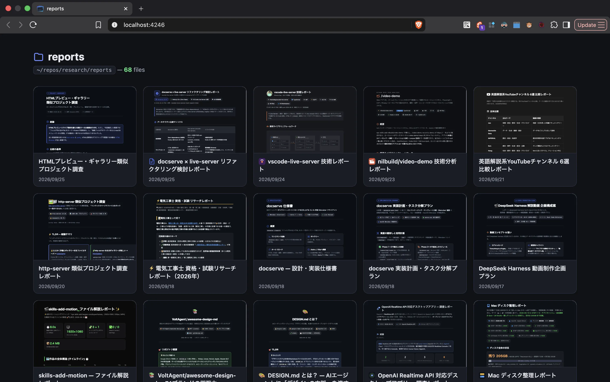
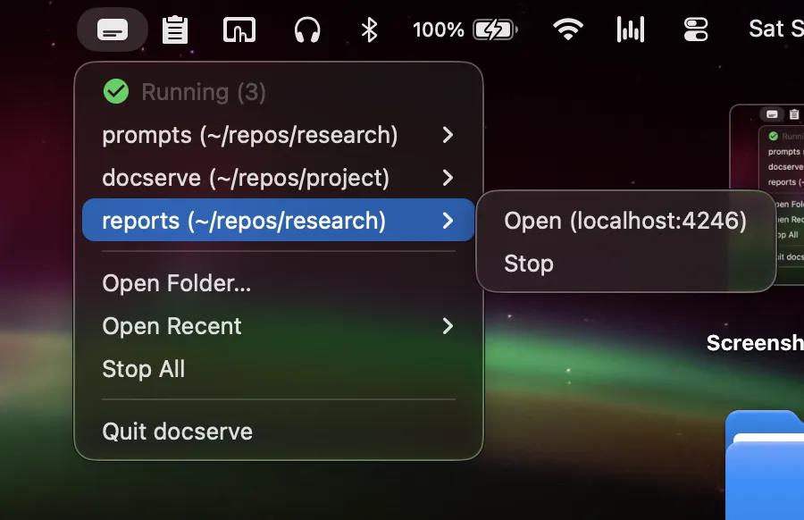

# docserve

Serves a folder of HTML as a card gallery with live reload.



[Homepage](https://noy4.github.io/docserve/)

## ✨ Features

- 🖼️ **Gallery** — card grid, iframe previews, copy path
- 🔄 **Auto reload** — add/edit/delete reflected instantly via WebSocket
- 🧭 **Desktop & CLI** — control it from the menu bar or the terminal

## 🖥️ Desktop app



1. **Download** — the DMG for your Mac from [Releases](../../releases) (`arm64` for Apple Silicon)
2. **Launch** — on the security warning, click **Done** (not **Move to Trash**), then approve via **Open Anyway** in `System Settings → Privacy & Security`
    > **Note:** The app isn't verified by Apple — that requires joining the Apple Developer Program, $99/year
3. **Pick a folder** — the gallery opens in your browser

## ⌨️ CLI

```bash
npx @noy4/docserve ~/reports --open   # serve a folder (npx @noy4/docserve <folder>)
npx @noy4/docserve stop               # stop all running servers
```

Or install globally: `npm install -g @noy4/docserve` — then run `docserve <folder>`.

## ⚖️ License

[MIT](./LICENSE)
